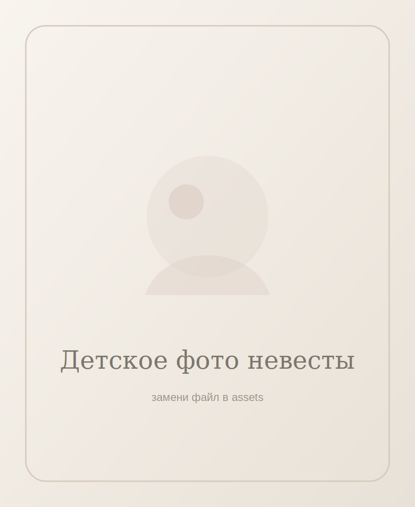
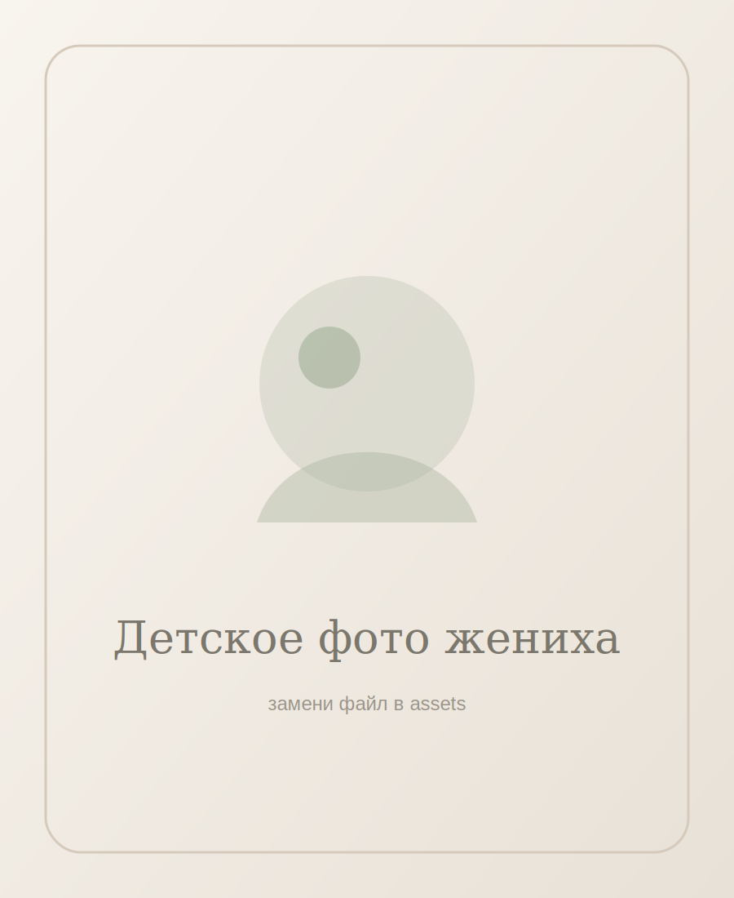
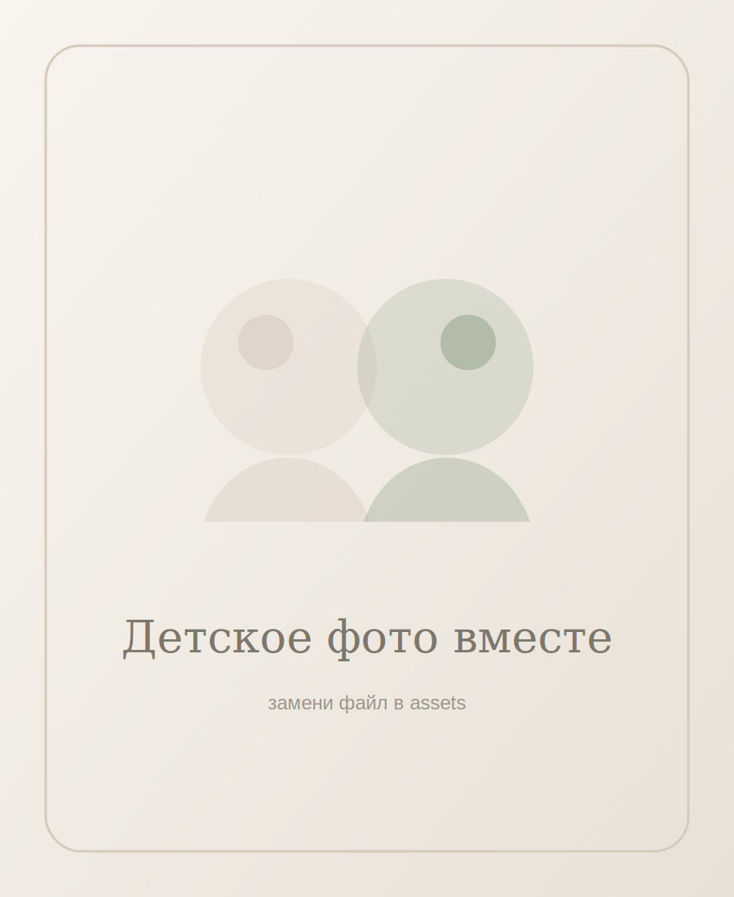
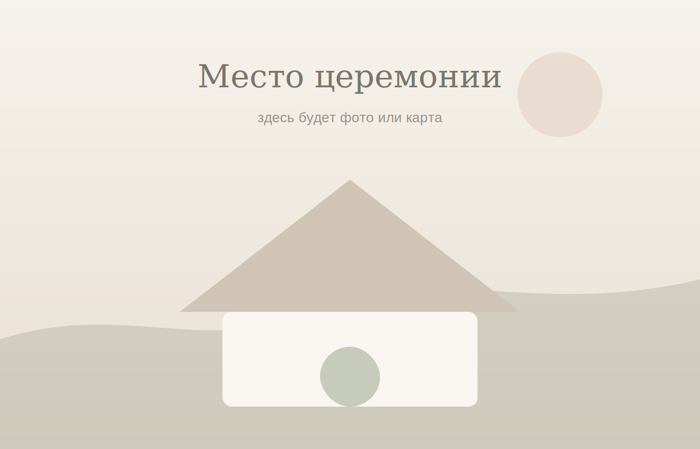

# Свадебное приглашение — статический сайт

Готовый простой сайт без бэкенда: `index.html + style.css + script.js`.

## Как открыть

Открой файл `index.html` в браузере двойным кликом.

## Как заменить имена и дату

Открой `script.js` и поменяй:

```js
const CONFIG = {
  brideName: "Имя невесты",
  groomName: "Имя жениха",
  weddingDate: "2026-09-26T13:00:00+09:00",
  rsvpEmail: "your-email@example.com"
};
```

`rsvpEmail` — почта, на которую гости будут отправлять ответы.

## Как заменить фото

Положи фото в папку `assets`, например:

- `bride-child.jpg`
- `groom-child.jpg`
- `together-child.jpg`
- `venue.jpg`

Потом в `index.html` замени:

```html




```

на реальные файлы.

## Важное ограничение формы

Так как сайт без бэкенда, он не может сам собрать ответы гостей в одну базу.
Сейчас форма открывает письмо `mailto:` с готовым текстом. Гость должен нажать «Отправить» в почтовом клиенте.

Самый простой рабочий вариант для сбора ответов без собственного бэкенда:
- встроить Google Form / Яндекс Форму / Tally;
- либо оставить `mailto:`, если гостей немного.
